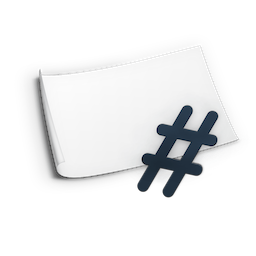
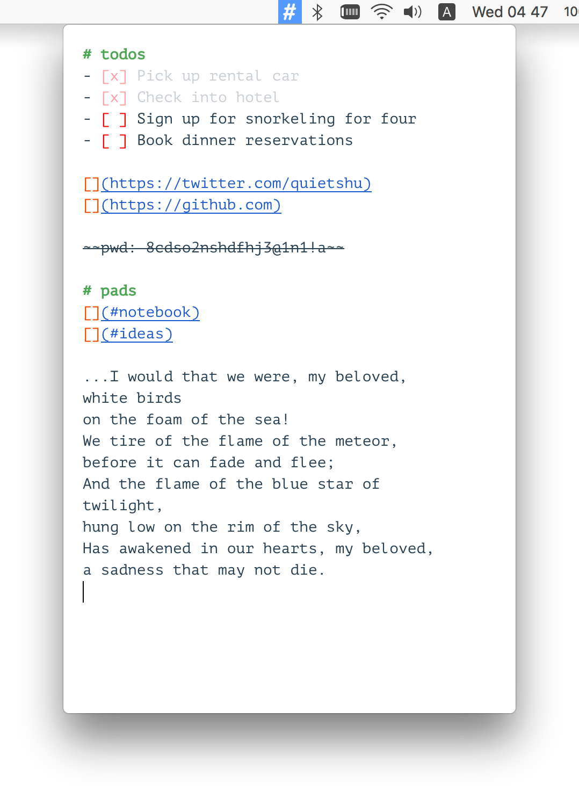
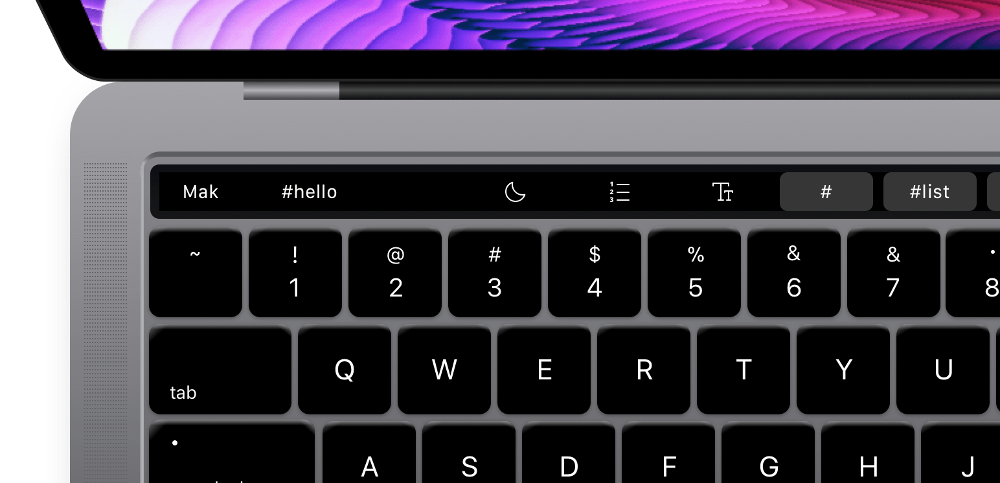
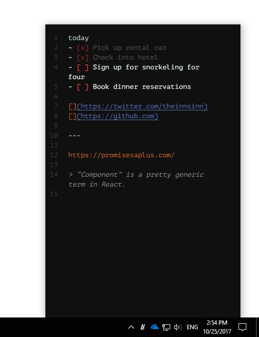

<h1 align="center">Makmini</h1>

<h5 align="center">A (small) piece of paper. Build on top of <a href="https://github.com/inns/mak">Mak</a>.</h5>

  
  
  
  

## The App
[Download latest releases](https://github.com/inns/mak-mini/releases)  
[Changelog](https://github.com/inns/mak-mini/blob/master/CHANGELOG.md)  
[Web version](https://github.com/inns/mak)

For detailed documentation and live demos, please visit https://github.com/inns/mak and https://inns.studio/mak.  
If you have any suggestions or feedbacks, feel free to open a issue.

Join [Mak User Group](https://t.me/mak_ink) ([中文用户群](https://t.me/mak_ink_cn)) on Telegram.

### macOS

Makmini is the menubar version of [Mak](https://mak.ink). But unlike the browser version, Makmini is **NOT** designed to be focused on for long writings. The goal of it is **easy to access**.

That said, many features in Mak (like read/split preview mode) are disabled in Makmini.

You can use it just like other stickers app, to-do lists, quick notes, a temporary clipboard with read-it-later URLs. You can put inside **anything you don't know where to put**.

  

### TouchBar

TouchBar buttons let you navigate between your notes quickly.

  

### Windows

Makmini also comes with a Windows version. The dark theme looks gorgeous in Windows 10.

  

## Development

Makmini is built on top of Electron.

### Install dependencies
`$ yarn`

### Get started
Run `$ yarn dev`.  

When running in development mode, you can use the Inspector for debugging.

### Build Production
Run `$ yarn build` to generate a build for your environment (darwin/win32/etc.).  

## License & Acknowledgement
[TBD.]

By Shu (g@shud.in), SH 2017
https://shud.in
